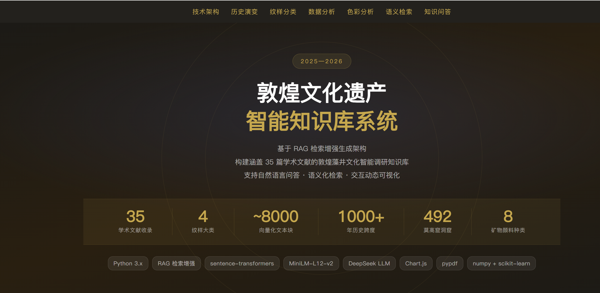
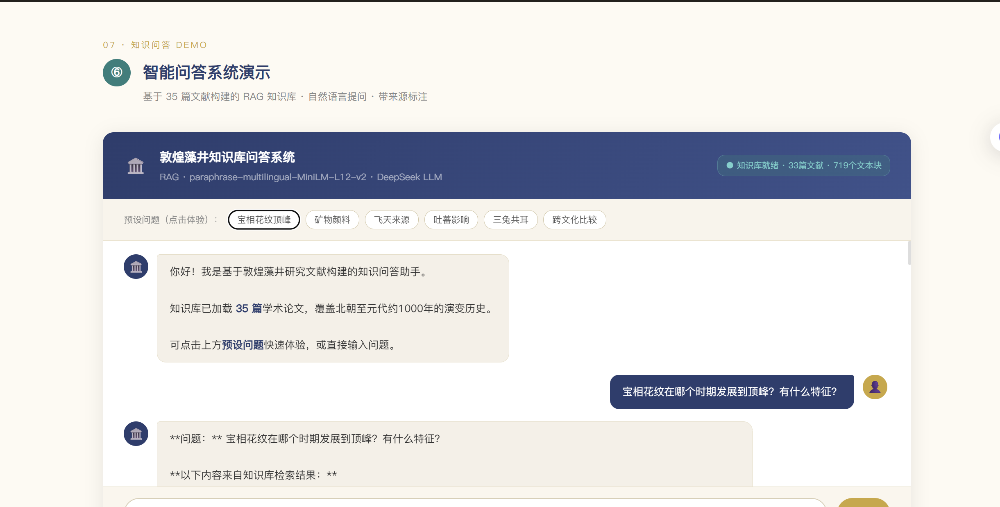
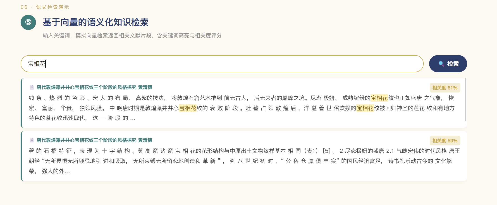
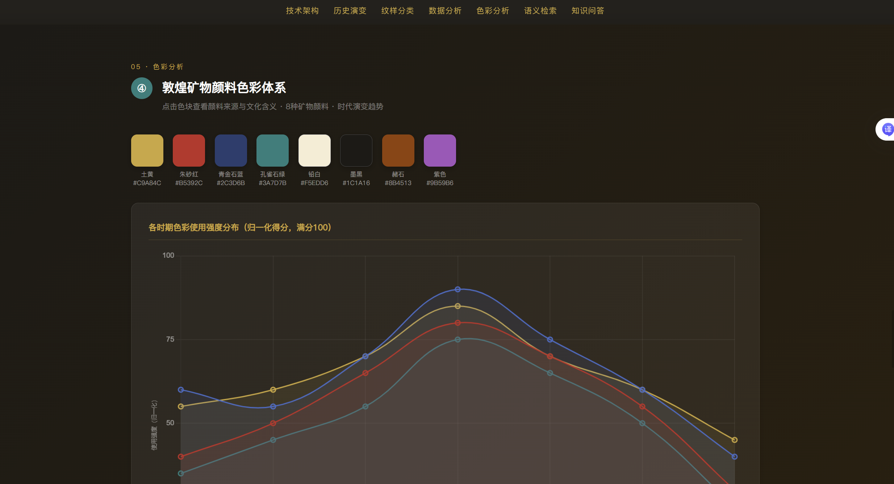
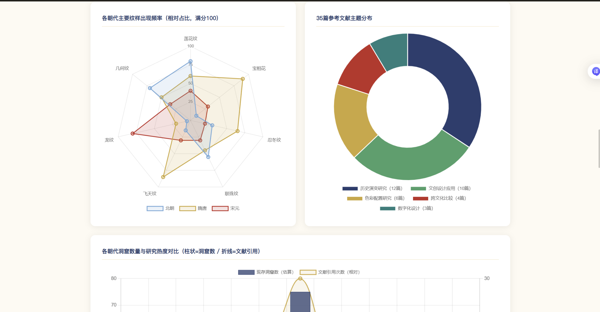

<p align="center">
  <h1 align="center">🏛️ 敦煌文化遗产智能知识库系统</h1>
  <p align="center">
    <strong>Dunhuang Cultural Heritage AI Knowledge Base</strong>
  </p>
  <p align="center">
    基于 RAG 架构的敦煌学智能问答与语义检索平台
  </p>
</p>

---

## 项目简介

本人在学习人工智能与自然语言处理的过程中，独立完成了这个敦煌文化遗产智能知识库系统。系统收录了 **35 篇**敦煌藻井相关的学术论文，通过 RAG（检索增强生成）技术，支持自然语言问答和语义检索。

作为一项学习实践作品，知识库的内容基于学术文献构建，力求数据的准确性与严谨性，但受限于个人的学识和经验，可能存在不够准确或不够全面的地方。如有疏漏，恳请各位前辈和同学指教，非常欢迎交流学习。

> ⚡ **核心特性**：语义理解检索（非关键词匹配）· 来源可追溯 · 交互式界面 · 可本地部署

---

## 目标用户

| 用户类型 | 使用场景 |
|---------|---------|
| **敦煌学研究者** | 快速检索相关文献片段，辅助论文写作 |
| **艺术史学生** | 通过问答了解敦煌艺术演变脉络 |
| **文化爱好者** | 以交互方式了解敦煌文化知识 |
| **AI/NLP 学习者** | 参考 RAG 架构的入门级工程实现 |

---

## 核心功能

### 💬 智能问答
- 对话式交互界面，支持多轮追问
- 基于 RAG 架构：检索 → 上下文注入 → LLM 生成
- 每条回答标注来源文献，支持学术引用
- 首页提供引导示例，降低使用门槛

### 🔍 语义检索
- 自然语言输入，理解语义而非仅匹配关键词
- 返回相关度评分与文献片段预览
- 支持自定义返回数量（3/5/10 条）

### 📊 数据看板
- 纹样分类体系可视化（4 大类 15+ 子类）
- 各朝代藻井演变趋势图
- 敦煌矿物颜料色彩分析
- 知识库文献统计分布

### 🎨 敦煌风格前端
- 采用敦煌壁画金/靛蓝/米色配色
- 滚动动画与交互反馈
- 响应式布局，适配不同屏幕

### 🔧 技术特性
- **向量模型**：paraphrase-multilingual-MiniLM-L12-v2（384 维，50+ 语言）
- **检索策略**：余弦相似度 Top-K 召回，支持阈值过滤
- **索引缓存**：首次构建后持久化，后续秒级加载
- **配置分离**：YAML 集中管理，环境变量注入 API Key

---

## 技术架构

```
用户提问（自然语言）
        │
        ▼
┌───────────────────────────────────┐
│  1. 向量化（Embedding）            │  ← Sentence Transformers
│  2. 语义检索（Vector Search）      │  ← Cosine Similarity Top-K
│  3. 上下文注入（Prompt Build）     │  ← RAG Context Assembly
│  4. 生成回答（LLM）               │  ← DeepSeek / OpenAI API
└───────────────────────────────────┘
        │
        ▼
  带来源标注的准确回答
```

### 为什么用 RAG 而非纯 LLM？

| 问题 | 纯 LLM | RAG（本项目） |
|------|--------|-------------|
| 幻觉 | ❌ 可能编造不存在的文化细节 | ✅ 基于真实文献回答 |
| 知识更新 | ❌ 训练数据截止后无法更新 | ✅ 添加文献即扩展 |
| 可追溯性 | ❌ 无法验证回答来源 | ✅ 每条回答标注出处 |
| 学术适用性 | ❌ 不适合严肃学术场景 | ✅ 有据可查，支持引用 |

### 技术栈

| 模块 | 技术 | 说明 |
|------|------|------|
| 向量模型 | Sentence Transformers | multilingual-MiniLM-L12-v2 |
| 语义检索 | NumPy + Scikit-learn | 余弦相似度 |
| LLM 接口 | OpenAI SDK | 兼容 DeepSeek / 本地模型 |
| PDF 处理 | pypdf | 批量文本提取 |
| Web 后端 | Flask + flask-cors | RESTful API |
| 前端界面 | HTML + CSS + JS | 敦煌风格交互界面 |
| 管理后台 | Streamlit | 数据看板与内容管理 |
| 可视化 | Plotly + Chart.js | 交互式图表 |
| 配置管理 | PyYAML | 集中式配置 |

---

## 安装步骤

### 环境要求

- Python 3.9+
- pip

### 快速安装

```bash
# 1. 克隆项目
git clone https://github.com/qiadastrachen-bit/dunhuang-knowledge-base.git
cd dunhuang-knowledge-base

# 2. 创建虚拟环境（推荐）
python -m venv venv
# Windows:
venv\Scripts\activate
# macOS/Linux:
source venv/bin/activate

# 3. 安装依赖
pip install -r requirements.txt

# 4. 准备数据
# 将 PDF 文献放入 data/raw/ 目录

# 5. 启动系统
python run.py
```

首次运行时，系统会自动：
1. 解析 `data/raw/` 下的所有 PDF 文件
2. 按滑动窗口（500 字/块，50 字重叠）切分文本
3. 生成向量嵌入并缓存到 `data/processed/`
4. 启动 Web 前端界面（默认端口 5000）

> ⏱️ 首次构建约需 3-5 分钟（取决于 PDF 数量和硬件性能），后续启动秒级加载。

### 可选：启用 AI 生成模式

默认使用检索摘要模式（无需 API Key）。如需 AI 生成完整回答：

```bash
# 方式一：环境变量
export DUNHUANG_API_KEY="your-api-key"  # macOS/Linux
set DUNHUANG_API_KEY=your-api-key       # Windows CMD

# 方式二：在 config/settings.yaml 中配置
```

支持 DeepSeek、OpenAI 及任何 OpenAI 兼容接口。

---

## 使用方法

### 启动

```bash
python run.py              # Web 模式（默认，Flask + 前端，端口 5000）
python run.py --mode ui    # Streamlit 管理后台
python run.py --mode api   # 仅 API 服务器
python run.py --port 8080  # 自定义端口
```

### 界面导航

**Web 前端（主界面）：**

| 页面区域 | 功能 |
|---------|------|
| 🏠 Hero 首屏 | 项目介绍、数据概览、引导入口 |
| 🏗️ 技术架构 | RAG 流程与技术栈说明 |
| 📜 历史演变 | 各朝代藻井纹样发展概览 |
| 🎨 纹样分类 | 4 大类纹样体系展示 |
| 📊 数据分析 | 交互式图表可视化 |
| 🎨 色彩分析 | 敦煌矿物颜料介绍 |
| 🔍 语义检索 | 自然语言文献搜索 |
| 💬 知识问答 | RAG 智能问答 |

**Streamlit 管理后台：**

| 页面 | 功能 |
|------|------|
| 🏠 首页 | 项目介绍、引导示例、数据概览 |
| 💬 智能问答 | 对话式 RAG 问答 |
| 🔍 语义检索 | 文献片段搜索 |
| 📊 数据看板 | Plotly 可视化图表 |
| ℹ️ 关于 | 项目背景与技术架构 |

### 快速体验

1. 打开 `http://localhost:5000`，浏览首页各区域
2. 在「语义检索」区域输入关键词（如"宝相花"、"藻井"）
3. 在「知识问答」区域提问，查看回答及来源标注

---

## API 接口

Flask 后端提供以下 RESTful API：

| 接口 | 方法 | 说明 |
|------|------|------|
| `/api/status` | GET | 知识库状态（PDF 数量、文本块数量、索引状态） |
| `/api/search` | POST | 语义检索（body: `{"query": "...", "top_k": 5}`） |
| `/api/ask` | POST | RAG 问答（body: `{"question": "...", "top_k": 5, "use_llm": false}`） |

---

## 项目结构

```
dunhuang-knowledge-base/
├── api/
│   ├── __init__.py           # API 模块初始化
│   └── server.py             # Flask 后端（RESTful API + 静态文件服务）
├── config/
│   ├── __init__.py           # 配置加载工具
│   └── settings.yaml         # 集中配置文件
├── core/
│   ├── __init__.py
│   ├── pdf_parser.py         # PDF 文本提取
│   ├── chunker.py            # 滑动窗口分块
│   ├── vectorizer.py         # 向量化 & 语义检索
│   └── rag_engine.py         # RAG 检索增强生成
├── ui/
│   ├── __init__.py
│   ├── app.py                # Streamlit 管理后台
│   └── templates/
│       └── demo.html         # Web 前端主页面
├── utils/
│   ├── __init__.py
│   └── logger.py             # 日志工具
├── data/
│   ├── raw/                  # PDF 文献（需自行放入）
│   └── processed/            # 向量索引缓存（自动生成）
├── docs/
│   └── screenshots/          # 项目截图
├── .gitignore
├── requirements.txt
├── run.py                    # 一键启动入口
└── README.md
```

---

## 项目截图

> 📸 使用时替换为实际截图，截图请放入 `docs/screenshots/` 目录

| 首页 | 知识问答 |
|------|---------|
|  |  |

| 语义检索 | 色彩分析 |
|---------|---------|
|  |  |

| 数据看板 | |
|---------|---|
|  | |

---

## Roadmap

### ✅ 已完成（v1.0）

- [x] PDF 批量解析与文本提取
- [x] 滑动窗口分块（可配置大小与重叠）
- [x] 语义向量检索引擎（余弦相似度 Top-K）
- [x] RAG 检索增强生成（支持 OpenAI 兼容 API）
- [x] 向量索引持久化与快速加载
- [x] Flask API 后端（RESTful 接口）
- [x] 敦煌风格 Web 前端（语义检索 + 知识问答）
- [x] Streamlit 管理后台（数据看板 + 可视化）
- [x] YAML 集中配置管理
- [x] 引导示例与来源标注

### 🔜 规划中（v2.0）

- [ ] 图像检索（CLIP / 以图搜图）
- [ ] 知识图谱构建（从向量升级为结构化图谱）
- [ ] 向量模型升级（bge-m3 / 领域微调）
- [ ] 多用户支持与对话历史持久化
- [ ] Docker 容器化部署
- [ ] 3D 洞窟藻井可视化（Three.js）

---

## 作者

**陈锦彤** — 在校大学生，本人在学习过程中独立完成了本项目的系统设计、开发与实现。

本项目作为学习实践作品，如有不足之处，恳请各位前辈和同学不吝指教，欢迎交流学习。

---

## 许可证

本项目仅供学术研究与学习交流使用。文献版权归原作者所有。

---

<p align="center">
  Built with ❤️ for Dunhuang Cultural Heritage
</p>
